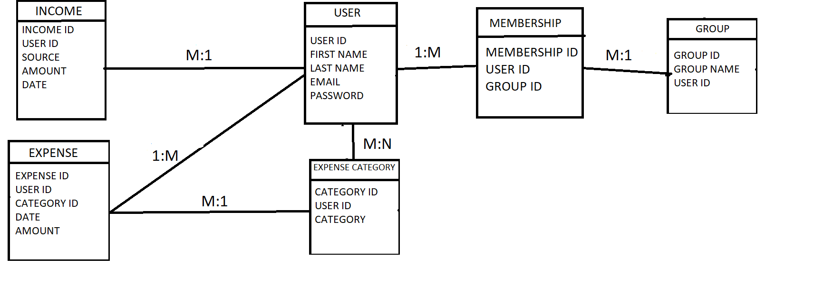
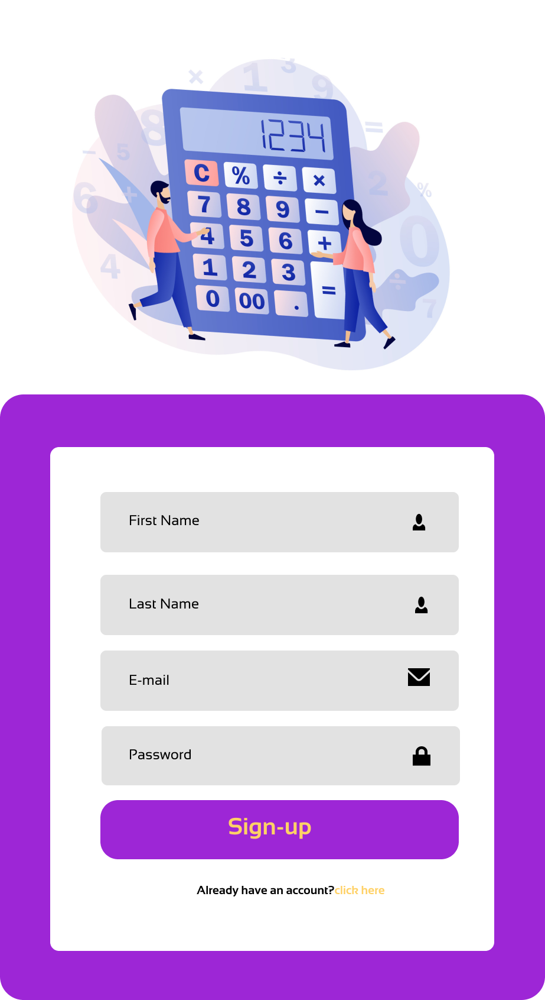
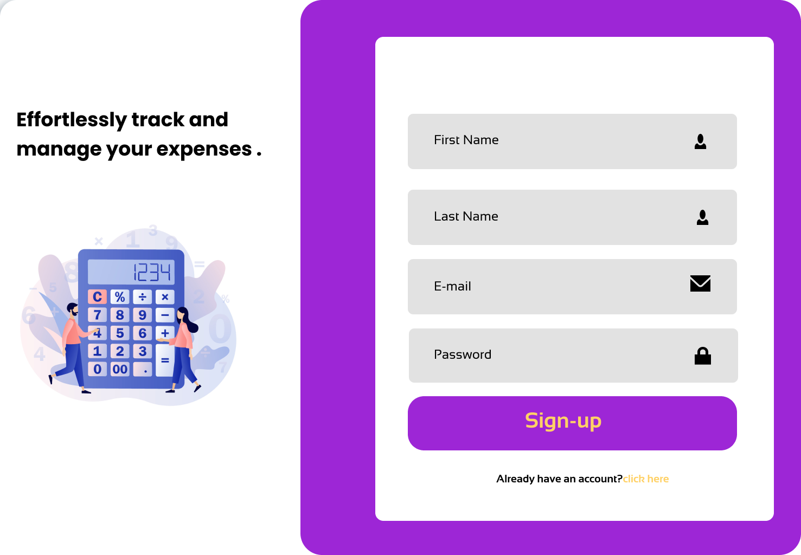
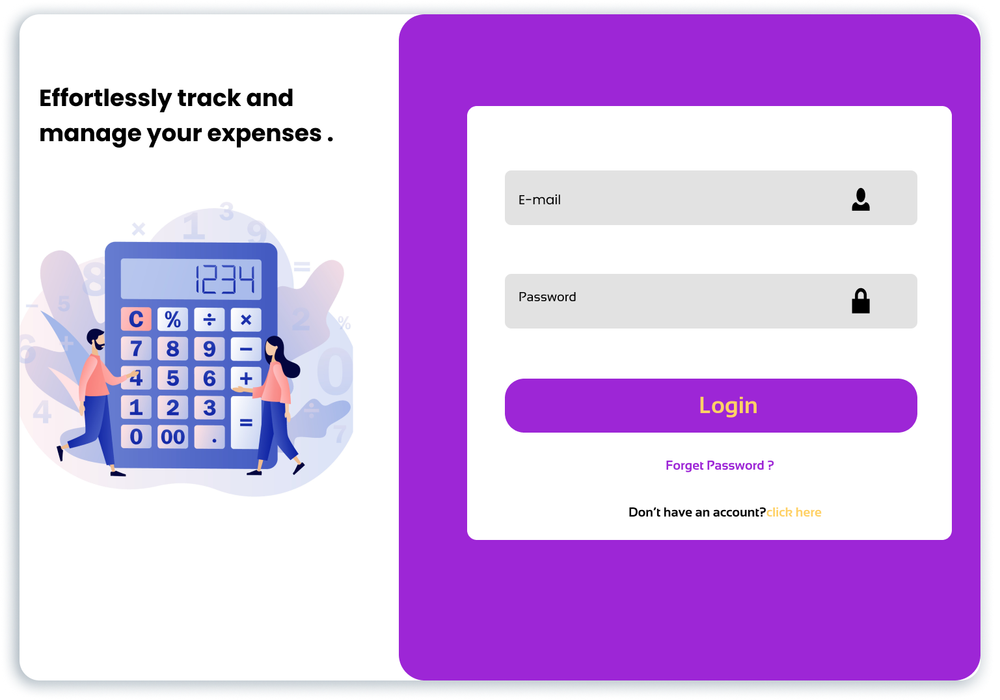

# 🎯 EXPENDITURE CALCULATOR
- The Expenditure Calculator Project is a web-based application designed to help users track and manage their expenses efficiently. 

- It allows users to categorize their expenses and provides a user-friendly interface to input and view financial data. 

- The users can track the expenses on a particular category they have spent.They can also track the expense on a particular day,month and year.

- The users can also create group among themselves with their family or friends which helps to track the expenses of the total family throughout the particular period of time.

## ER DIAGRAM
## 
## `NORMALISATION:`
- ### 1NF:
    - ✔ Each table has its own `primary key`

    - ✔ There is no '`atomic`'(indivisible) value

- ### 2NF:
    - ✔Follows 1NF.

    - ✔There is no partial `depencies`(no `primary key` determines some other attributes.)

- ### 3NF:
    - ✔Follows 3NF.

    - ✔There is no transitive `depencies`(no non-key attribute determines some other attribute).

- ### 4NF:
    - ✔ Follows 4NF.

    - ✔ No multi-valued `depencies`.

Since these all the four Normalisation are followed by our table,the table is in the normalisation form.

## `EXPLANATION`:
- This ER Diagram consists of the tables `User`,`Income`,- `Expense category`,`Expense`,`Membership` and the `group`.
- The `user table `consists of the details of the user.
- The `income table` consists of the Income details of a particular user like source of the income,amount,and the date of recieving the income.
- The `expense category table ` consists of the information on the particular category the user have spent.
- The `expense table `consists of the information of the expense spent by the user on the particular category with the date and the amount they have spent.
- The membership table  links the table group and the user.
- The group table allows the users to create groups among the users.

## API CALLS NEEDED
- SIGN UP:

   - First Name

    - Last Name

    - E-mail Id

    - Password

- LOGIN:

   - Email Id

    - password

- EXPENSE:

 #### `Expense for particular Category,Day,Month,Year`

- CATEGORY(single user):
     - User id

    - Category name

- PARTICULAR DATE:

    - user id

     - Date & Month & Year

- PARTICULAR MONTH:

    - User id

     - Month & Year

- PARTICULAR  YEAR:

     - User id

     - Year

- PARTICULAR CATEGORY on PARTICULAR YEAR:(ex:total expense spent during 2022)

    - User id

     - Category name

    - Year

- PARTICULAR CATEGORY on PARTICULAR MONTH:

     - User id

     - Category name

     - Month & Year

## `EXPLANATION:`
- If the user sends the request for loging in ,the user is able to login in only if the email id and the password matches to the one in the `user table `
- Similarly if the user sends a request to see the expense on a particular date,the details will be fetched from the expense table which correseponds to that date and category.

- These are the design for the desktop and moblie view signup and login pages where the user can create only one account with one email id .This will be checked at the time of signup .

- The user will be entering the name,email id and the password at the time of login. This will be sent to the database .

- If the email is already registerd alert message will be sent that only one account can be created by one email id (i.e. Account already exists).

- Similarly for login,At the time of login the email id entered should be already present in the database and also the password should match with the entered password .

- If any one of the creteria is not achieved the user will get the alert message as (invalid username or password).